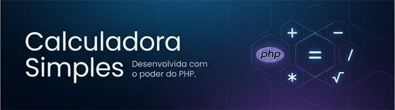
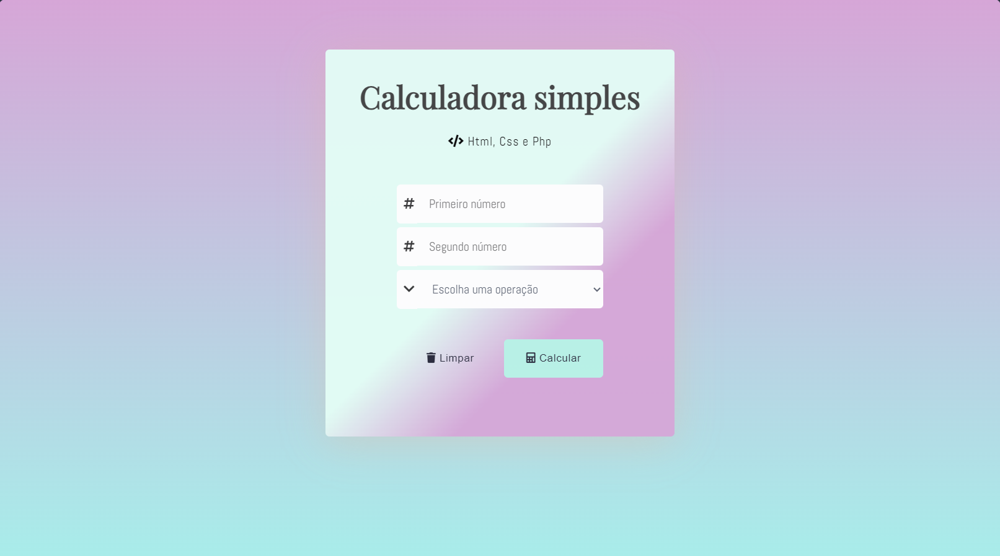
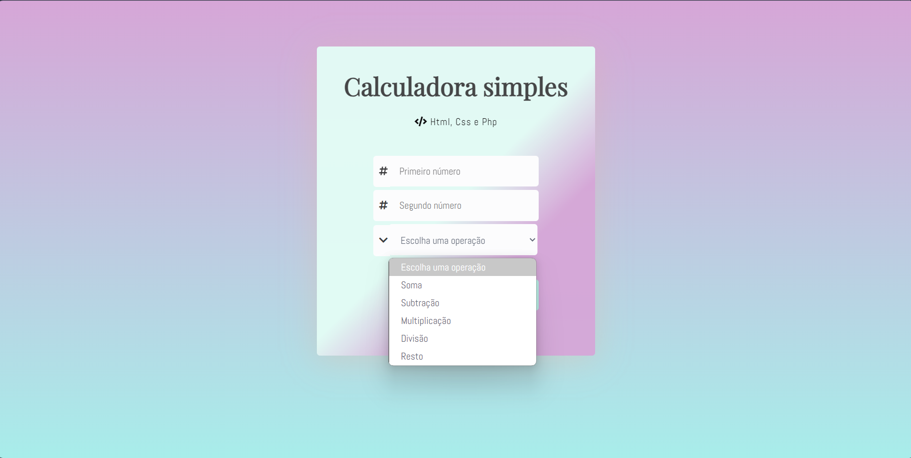

<h1 align="center">
     Calculadora Simples em PHP
  <br />
  <br />
  <a href="https://github.com/StellaKarolinaNunes/Calculadora-Simples-em-PHP">
   
  </a>
</h1>

</div>

<p align="center">
  
  
  
  
  
</p>

<br>

---

## Introdução
Bem-vindo ao projeto Calculadora Simples em PHP! Esta é uma ferramenta prática e eficiente, projetada para oferecer uma experiência de cálculo fluida através de uma interface web moderna, minimalista e totalmente responsiva.

<br>

## Por que este projeto?
O desenvolvimento desta calculadora surgiu do desejo de unir a robustez do PHP no processamento de dados com a elegância do HTML e CSS no front-end. O objetivo foi criar uma aplicação leve que demonstrasse como uma lógica de backend sólida pode ser apresentada de forma profissional e amigável ao usuário final.

<br>

## A Solução
A aplicação entrega uma interface intuitiva onde a complexidade do código é ocultada por um design limpo. A solução oferece:

Agilidade: Processamento instantâneo de operações básicas e resto da divisão.
Foco na UX: Design focado na experiência do usuário, evitando elementos desnecessários e distrações.
Portabilidade: Como uma aplicação web, ela funciona perfeitamente em qualquer navegador e dispositivo, adaptando-se a diferentes tamanhos de tela.

<br>

##  Funcionalidades
- Operações de Adição, Subtração, Multiplicação e Divisão.
- Interface amigável e responsiva.
- Processamento do lado do servidor com PHP.

<br>

##  Preview

<div align="center">





</div>

 
  ---

 ##  Estrutura de Pastas

```bash
├── assets
│   └── images
│       ├── banner.png
│       ├── escolha_operacao.png
│       └── tela_inicial.png
├── css
│   ├── animations
│   │   └── button-animations.css
│   ├── base
│   │   ├── reset.css
│   │   └── variables.css
│   ├── components
│   │   ├── input.css
│   │   └── result.css
│   ├── layout
│   │   ├── button.css
│   │   ├── form.css
│   │   └── header.css
│   ├── main.css
│   └── responsivo
│       └── responsive.css
├── index.php
├── License
│   └── License
└── README.md
```

 <br>

##  Instalação

### Pré-requisitos para Rodar a Calculadora Simples em PHP na sua máquina

- PHP 7.4 ou superior
- Apache ou Nginx
- MySQL ou MariaDB
- Composer

<br>

###  Instalação Rápida

####  1. Clone o repositório

```bash
git clone https://github.com/StellaKarolinaNunes/Calculadora-Simples-em-PHP.git
```

####  2. Entre na pasta do projeto

```bash
cd Calculadora-Simples-em-PHP
```

####  3. Instale as dependências

```bash
composer install
```

####  4. Inicie o servidor

```bash
php -S localhost:8000
```

####  5. Acesse a calculadora no navegador

```bash
http://localhost:8000
```

##  Roadmap

### Fase 1: MVP (Mínimo Produto Viável) - Concluído
- [x]Operações matemáticas básicas (+, -, *, /).
- [x]Interface web funcional com HTML/CSS.
- [x]Processamento de dados via POST com PHP.

### Fase 2: Melhorias de UX & Design - Em Andamento
- [ ]Implementar Modo Escuro (Dark Mode).
- [ ]Adicionar Histórico de Cálculos (usando Sessões ou LocalStorage).
- [ ]Suporte a Atalhos do Teclado para números e operações.
- [ ]Melhorar animações de feedback visual nos botões.

### Fase 3: Funções Avançadas
- [ ]Implementar operações de Potenciação e Raiz Quadrada.
- [ ]Adicionar funções científicas básicas (Seno, Cosseno, Tangente).
- [ ]Suporte para cálculos com Parênteses e precedência matemática.
- [ ]Botão de "Limpar Memória" (MC, MR, M+, M-).

### Fase 4: Excelência Técnica & Portabilidade
- [ ]Implementar Testes Unitários com PHPUnit para garantir a precisão dos cálculos.
- [ ]Criar uma API REST para que a lógica da calculadora possa ser usada por outros apps.
- [ ]Implementar validações de erro mais avançadas (ex: divisão por zero com avisos amigáveis).
- [ ]Refatoração para o padrão MVC (Model-View-Controller).

<br>

 ##  Contribuição
Contribuições são muito bem-vindas! Siga estes passos:

### Como Contribuir
1. **Fork** este repositório
2. **Clone** seu fork localmente
3. **Crie** uma branch para sua feature: `git checkout -b feature/nova-funcionalidade`
4. **Faça** suas alterações e commits
5. **Teste** suas modificações
6. **Abra** um Pull Request detalhado

<br>

###  Diretrizes

- Código limpo e bem comentado
- Mensagens de commit claras e objetivas
- Teste todas as funcionalidades
- Mantenha a documentação atualizada
- Siga os padrões de código existentes

<br>

##  Licença

Este projeto está licenciado sob a [Licença MIT](./License/License).

``` bash
MIT License - você pode usar, modificar e distribuir livremente,
mantendo a referência ao repositório original.
```

 <br>

 ## Contato

 Se você tiver dúvidas, sugestões ou quiser saber mais sobre o projeto, entre em contato:

 - **Principais Desenvolvedores:** [Stella Karolina](https://github.com/StellaKarolinaNunes)
 - **Repositório:** [Calculadora Simples em PHP no GitHub](https://github.com/StellaKarolinaNunes/Calculadora-Simples-em-PHP)
 - **LinkedIn:** [Stella Karolina Nunes](https://www.linkedin.com/in/stella-karolina/)

 <br>

 ## Créditos

 O **Calculadora Simples em PHP** é construído com o apoio de tecnologias e comunidades incríveis:

 - **Linguagem de Programação**[PHP](https://www.php.net/)
 - **Linguagem de Marcação**[HTML5 & CSS3](https://www.w3schools.com/)
 - **Linguagem de Estilo**[Font Awesome](https://fontawesome.com/)
 - **Fontes**[Google Fonts](https://fonts.google.com/)
 - **Badges**[Shields.io](https://shields.io/)
 - **Professor Orientador:** [Alex Santos de Oliveira](https://github.com/alex2024383)

 <br>

 
### Desenvolvimento Principal

<table>
  <tr>
    <td align="center">
      <a href="https://github.com/StellaKarolinaNunes">
        
        <br />
        <sub><b>Stella Karolina Nunes Peixoto</b></sub>
        <br />
      </a>
    </td>
  </tr>
</table>